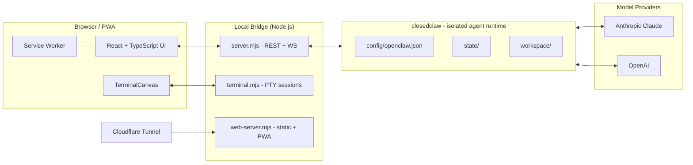

# Konex OS

> A personal AI agent command hub. Web-based control plane for local agents, terminal workflows, and remote model orchestration — built solo, designed to be lived in.


---

## What it is

**Konex OS** is a self-hosted web app I built so I could work with AI agents the way I actually use them: many parallel terminal sessions, multiple models, a shared workspace, and full access from my phone when I'm not at my desk.

It's a Progressive Web App on the frontend, a small Node.js bridge in the middle, and an isolated agent runtime underneath. A Cloudflare Tunnel exposes the whole stack securely so I can drop into a session from anywhere.

It's not a wrapper around someone else's product. It's a real piece of infrastructure I run every day.

## Why it exists

Off-the-shelf chat UIs treat each conversation as a sealed unit. That isn't how I work. I run multiple agents in parallel — one drafting code, one researching, one watching long-running terminal jobs — and I needed a control plane that matched that reality:

- One pane of glass for every active session
- A real terminal, not a fake one — `xterm`-style canvas wired into local shells
- Model switching mid-session without losing context
- Remote access that doesn't depend on a third-party SaaS
- Mobile-first, because half my best ideas happen away from the keyboard

So I built it.

## Architecture



## Tech stack

| Layer | Tools |
|---|---|
| **Frontend** | React, TypeScript, custom terminal canvas component, Progressive Web App (manifest + service worker), responsive UI tuned for mobile |
| **Bridge** | Node.js (`server.mjs`, `web-server.mjs`, `terminal.mjs`) — REST + WebSocket between the UI and local sessions |
| **Agent runtime** | Isolated OpenClaw-derived layer (internally referenced as `closedclaw`) with its own config, state dir, and workspace so it can run alongside other installs without conflicts |
| **Models** | OpenAI + Anthropic Claude, routed through the bridge with session-level model selection |
| **Remote access** | Cloudflare Tunnel + PowerShell provisioning scripts |
| **Autostart** | Windows boot integration via installer script |

## Project structure

```
konex-os/
├── src/                          Frontend (React + TypeScript)
│   ├── App.tsx                     App shell
│   ├── styles.css                  UI styling
│   ├── components/
│   │   └── TerminalCanvas.tsx      Interactive terminal viewport
│   └── lib/
│       ├── closedclaw.ts           Agent runtime client
│       └── terminals.ts            Terminal session client
├── bridge/                       Backend (Node.js)
│   ├── server.mjs                  Main bridge / API server
│   ├── web-server.mjs              Production web server
│   └── terminal.mjs                Terminal / PTY backend
├── closedclaw/                   Isolated agent runtime
│   ├── config/openclaw.json        Runtime config
│   ├── state/                      Persistent agent state
│   └── workspace/                  Active workspace
├── scripts/                      Lifecycle + provisioning (PowerShell)
│   ├── Start-KonexOS.ps1            Start local stack
│   ├── Start-KonexOSRemoteStack.ps1 Start with remote tunnel
│   ├── Setup-KonexOSRemote.ps1      One-time Cloudflare setup
│   └── Install-KonexOSAutostart.ps1 Register as boot service
└── public/                       PWA assets
    ├── manifest.webmanifest
    ├── konex-icon.svg
    └── sw.js
```

> **Naming note**: the internal API and state paths use `closedclaw` for compatibility with the underlying OpenClaw runtime. Public-facing name is **Konex OS**.

## Status & roadmap

**Working today**
- Multi-session terminal UI with live PTY streaming
- Mobile-installable PWA shell
- Remote access via Cloudflare Tunnel
- Multi-model routing (OpenAI + Anthropic)
- Persistent agent workspace + state
- Windows autostart

**In progress**
- Token / session awareness panel
- Task tracker wired into agent context
- Multi-agent coordination view (parallel sessions in one pane)

**Backlog**
- Voice control on mobile
- File sync between agents and host
- Session replay / debugging

## About

Built by **Bailey Moore** as a personal tool — and also as a practical, end-to-end demonstration of AI-first product engineering: UI ↔ bridge ↔ agent runtime ↔ remote access, all stitched together solo.

If you're hiring for AI-first engineering and want to see how I actually work, this is the artifact.

- Phoenix, AZ
- GitHub: [@Bailey-Moore17](https://github.com/Bailey-Moore17)

## License

MIT — see [LICENSE](LICENSE)
